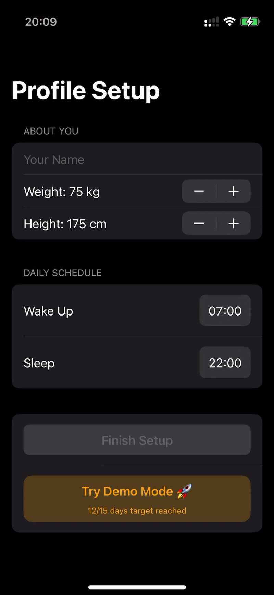
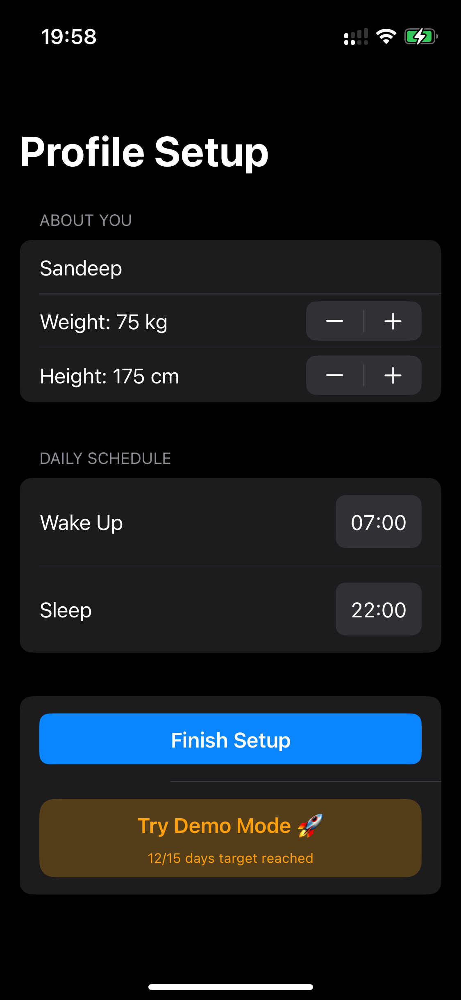
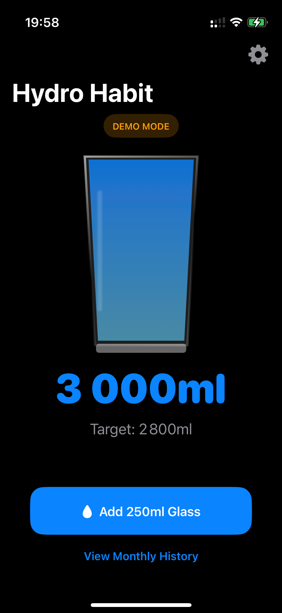
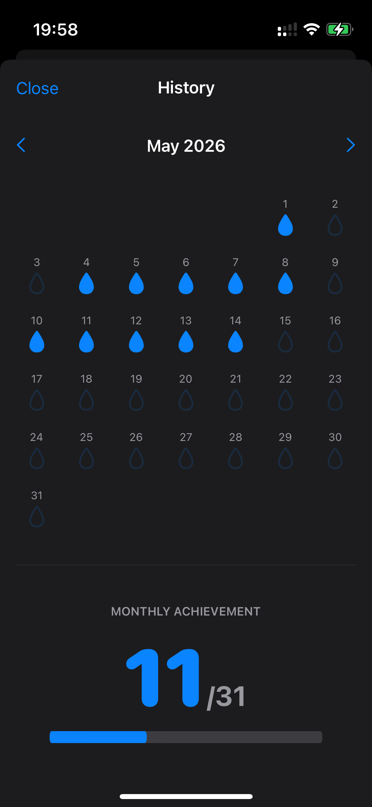

# 💧 HydroHabit - Smart Hydration Tracker

HydroHabit is an iOS 18 application designed to help users maintain optimal hydration levels. Unlike standard trackers, it uses intelligent scheduling to ensure reminders are healthy and non-intrusive.

## 🚀 Live Demo

  

### The One-Click Demo Engine
To make it easy for anyone to see the app in action, I built a **One-Click Demo Engine**. 
1. Open the app.
2. Tap **"Try Demo Mode"**.
3. Instantly see a populated dashboard with **15 days of historical data** (12 successful days, 3 failed days) and a pre-configured profile.

---

## 📸 Visual Showcase

| Profile Setup | Smart Dashboard | Monthly Progress |
| :---: | :---: | :---: |
|  |  |  |

---

## ✨ Key Features

- **Intelligent Scheduling:** Calculates reminders between wake and sleep times while automatically pausing for **45 minutes after meals**.
- **3D Tapered Glass:** A realistic, interactive UI component that fills dynamically as you log water.
- **Dual-Profile System:** Supports switching between a Primary User and a Demo User without data overlap.
- **Monthly Analytics:** High-impact dashboard showing total days the target was met vs. total days in the month.
- **SwiftData Persistence:** Everything is stored locally on-device but built with a repository pattern for easy cloud integration.

## 🛠 Tech Stack

- **Language:** Swift 6.0
- **UI Framework:** SwiftUI
- **Database:** SwiftData (iOS 18 persistence)
- **Notifications:** UserNotifications Framework

## 🏗 Architecture (Cloud-Ready)

The app is architected for scalability:
- **Models:** Uses SwiftData `@Model` classes with `Relationship` mapping to link water entries to specific users.
- **Managers:** A singleton `HydrationManager` handles the complex math of notification windowing and meal-time buffers.
- **Views:** Modular SwiftUI views decoupled from the data logic, making it easy to swap the local database for a Cloud API/Firebase later.

## ⚙️ Setup & Installation
1. Clone the repository.
2. Open `HydroHabit.xcodeproj` in **Xcode 16+**.
3. Select an **iOS 18** Simulator or Physical Device.
4. Build and Run (**Cmd + R**).
